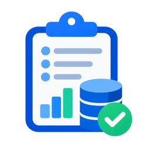

<div align="center">



# DBLabs

**Point it at a camera. Get a labelled dataset.**

A Windows desktop tool for building image datasets from camera frames — draw and label regions
by hand, or let it watch a live RTSP stream and collect person crops unattended.

[](#requirements)
[](https://dotnet.microsoft.com/)
[](https://github.com/shimat/opencvsharp)

</div>

---

## What it does

**Label by hand.** Open a frame — or a whole folder — draw a box around each subject, label it,
and press **Add Data**. Every region is cropped from the *original full-resolution* frame and
written into a folder named after its label:

```
<output>/Staff/frame_01_143502.jpg
<output>/Customer/frame_02_143502.jpg
```

**Save Database** closes the batch and writes `labels.csv`, tying every crop back to its source
frame and exact pixel rectangle — so a mislabelled crop is always traceable.

**Or collect automatically.** Point **Collect from RTSP** at a live stream, choose a sampling
rate and when to stop, and it detects people and writes each one out unattended. Near-identical
crops are skipped, so someone standing still doesn't fill the set with the same shot.

---

## The labelling loop

- Open a folder and step through frames with `N` / `P`
- Pick labels with the number keys `1`–`9`
- `Ctrl+Enter` adds the current frame's regions, `Ctrl+S` closes the batch
- Un-save a crop with `↶` if you mislabel it — deletes the file so you can redo it
- `Ctrl+D` duplicates a region, `Delete` removes it, `F` fits, `Ctrl+1` is 100%

## Unattended collection

| Setting | What it does |
|---|---|
| **Stream** | Pick from cameras saved by the RTSP Camera Viewer, or type any URL |
| **Frames per second** | A ceiling, not a promise — detection takes a few hundred ms, so the run reports what it actually achieved |
| **Stop when** | Duration, crop target, clock time — any combination, whichever happens first |
| **Output size** | Write every crop at one size (224/320/416/640) with a choice of fit, or keep natural sizes |
| **Minimum confidence** | Floors how sure the detector must be before a crop is written |
| **Variety** | How aggressively near-identical crops are skipped |

Collection runs in its own window — the main window stays usable while it works, and a dropped
stream is reconnected rather than ending the run.

---

## The detection model

Person detection uses **YOLOv8s**, which is **not bundled with this repository**. The weights are
[Ultralytics'](https://github.com/ultralytics/ultralytics) and licensed **AGPL-3.0**; shipping
them here would place that licence's obligations on this project, so the app downloads them on
first use instead.

The first time you start a collection run, DBLabs offers to fetch `yolov8s.onnx` (~43MB) into:

```
%AppData%\DBLabs\Models\yolov8s.onnx
```

You can also place the file there yourself. **If you redistribute a build that includes those
weights, AGPL-3.0 applies to what you distribute** — worth understanding before you package this
for anyone else.

---

## Building

```powershell
git clone https://github.com/ChakraDeep8/DBLabs.git
cd DBLabs
dotnet run -c Release --project DBLabs
```

Standalone build:

```powershell
dotnet publish DBLabs -c Release -r win-x64 --self-contained true -o publish
```

## Requirements

- Windows 10/11 x64
- .NET 8 SDK to build; a self-contained publish needs no runtime installed
- A reachable RTSP stream for the collection feature

---

## Notes

- RTSP uses OpenCV's bundled FFmpeg backend — no separate FFmpeg install.
- The label library persists per-machine under `%AppData%\DBLabs`, so labels follow you between
  datasets, and is shared with the
  [RTSP Camera Viewer](https://github.com/ChakraDeep8/RtspCameraViewer) camera list.
- Crops are always cut from the original full-resolution frame, never from the zoomed view.

<div align="center">
<sub>Built with WPF · .NET 8 · OpenCvSharp · ONNX Runtime</sub>
</div>
